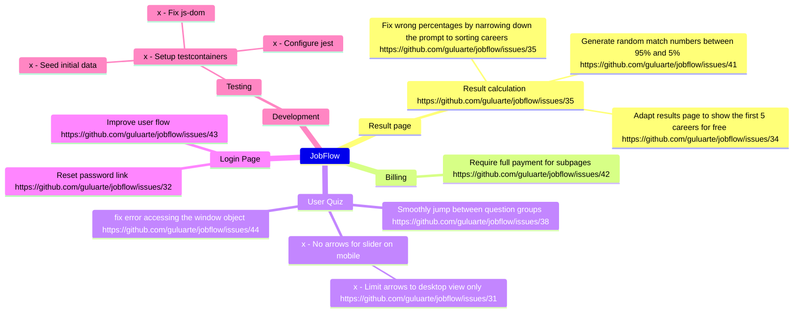

# JobFlow

## Current Tasks

## Testing 
### Company users
user@example.com ^1234567890$

### Premium user:
casdsfdsf@guluarte.com ^1234567890$

## Billing

Open a new browser window in incognito mode and go to https://app.quereinstieg.com/

Test cards for billing see [Stripe docs](https://stripe.com/docs/testing?testing-method=card-numbers#visa )

4242 4242 4242 4242

## Prerequisites

Doppler https://docs.doppler.com/docs/cli

Node 18.16.1

NVM

Docker

## Tech Stack

Programming Languages:
  - TypeScript

Frontend Frameworks:
  - React

Backend Frameworks:
  - Next.js
  
Database:
  - MySQL

External APIs:
  - OpenAI

Secret Managment:
  - Doppler

Content Managment System:
  - Directus

Design Systems:
  - Radix

**Setup Ubuntu VPS with Docker Compose**

**Step 1: Install Docker and Docker Compose and NGIX**

1. Connect to your Ubuntu VPS via SSH.
2. Install Docker: `sudo apt-get update && sudo apt-get install docker.io -y`
3. Install Docker Compose: `sudo apt-get install docker-compose -y`

**Step 2: Configure Doppler**

1. Install Doppler: `sudo apt-get install doppler -y`
2. Add the `www` user: `sudo useradd -m -s /bin/false www`
3. Configure Doppler to use the `www` user: `sudo doppler configure --user www`

**Step 3: Configure Nginx**

1. Copy the `nginx.conf` file from the project repository to the `/etc/nginx/sites-available/` directory: `sudo cp nginx/nginx.conf /etc/nginx/sites-available/default`
2. Create a symbolic link to enable the Nginx configuration: `sudo ln -s /etc/nginx/sites-available/default /etc/nginx/sites-enabled/`

**Step 5: Start Docker Compose**

1. Navigate to the project repository directory: `cd <repository-directory>`
2. Start Docker Compose: `sudo docker-compose up -d`

**Step 6: Pull app image**

1. Pull the app image `./start.sh`

**Step 7: Open ports**

1. ufw allow 443, ufw allow 80, ufw allow 3306

**Step 7: Verify the setup**

1. Verify that Docker Compose is running: `sudo docker-compose ps`
2. Verify that Nginx is running: `sudo service nginx status`

